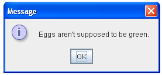
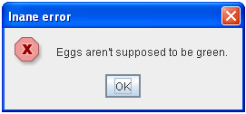
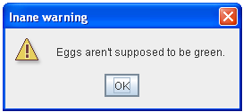
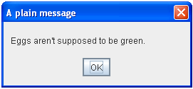

# Unit 3 - Decision Structures

## [**L10 Sandbox**][sandbox]

## Conditional Operator

The last and most powerful decision structure is the [**Conditional Operator**](https://www.tutorialspoint.com/What-is-the-conditional-operator-in-Java). Its primary usage is to assign a value to a variable based on a condition, or if-statement.

The syntax is: 
`(boolean expression) ? (value if true) : (value if false)`

_A phone company charges $0.99 per MB of data with a minimum of $50 per month._

In this problem, the monthly cost of a phone plan is either 0.99 * data or $50 whichever is higher. 

```java
double totalMonthly = dataUsed * 0.99;

totalMonthly = (totalMonthy> 50.0)?totalMonthly:50.0
```

This is exactly the same as the following:
```java
double totalMonthly = dataUsed * 0.99;

if(totalMonthly > 50.0)
    totalMonthly = totalMOnthly;
else
    totalMonthly = 50.0
```

## More Dialog Boxes

We've worked with input dialog boxes and message dialog boxes. There are many other dialog boxes, but the next one is a more generic box; the `showOptionDialog` box. This dialog prompts the user to select either Yes/No or Yes/No/Cancel. The main thing to remember is that it returns **an integer** value representing the users choice.

  
 

The `showOptionDialog` has a lot of options. The full list of parameters is: 

`public static showOptionDialog(Component parentComponent, Object message, String title, int optionType, int messageType, Icon icon, Object[] options, Object initialValue)`

Each parameter only accepts certain arguments. Each part is listed below and the arguments it accepts. 

* parentComponent - `null`
* message - String message to the user: "Would you like green eggs and ham?"
* title - The title of the box in top left: "An Inane Question", "A Silly Question"
* optionType - This determines how many buttons show up, max 3. Each option is preceded with `JOptionPane.`
    * `DEFAULT_OPTION` for a single OK button
    * `OK_CANCEL_OPTION` for OK and Cancel buttons
    * `YES_NO_CANCEL_OPTION` for Yes, No, and Cancel buttons
    * `YES_NO_OPTION` for Yes and No buttons
* messageType - determines the icon used next to the message. These also need to be preceded with `JOptionPane.` Options are: 
    *  - `INFORMATION_MESSAGE` - Default
    *  - `ERROR_MESSAGE`
    *  - `WARNING_MESSAGE`
    *  - `PLAIN_MESSAGE`
* icon - `null`, this is used if you want to add a custom icon instead of the messageType icons.
* options - This allows you to change the text of the buttons: `["Yes, please", "No, thanks", "No eggs, no ham!"]` This must be specified prior to creating the dialog box. This is called an **array** which we will discuss further in other units.
* initialValue - This selects which option to have highlighted. Leave blank to default to the first one.

Putting all this together and the code below creates the dialog box you see below:

```
 Object[] options = {"Yes, please", "No, thanks", "No eggs, no ham!"};      
 int n = JOptionPane.showOptionDialog(null,
     "Would you like some green eggs to go "
     + "with that ham?",
     "A Silly Question",
     JOptionPane.YES_NO_CANCEL_OPTION,
     JOptionPane.QUESTION_MESSAGE,
     null,
     options,
     options[2]);
```
     


## DIALOG BOXES AND CONDITIONAL OPERATOR

Now that we can create dialog boxes, we need to know how to check which option the user selected. These are also static methods in the `JOptionPane` class.  

* `JOptionPane.YES_OPTION`
* `JOptionPane.NO_OPTION`
* `JOptionPane.CANCEL_OPTION`
* `JOptionPane.OK_OPTION`

Notice that the `showOptionDialog` box returns as an integer which can be compared against the constant values above. 

Here is a simple program that asks the user if they are 16 years or older. 

```java
import javax.swing.*;

public class L10{
    public static void main(String[] args){
            int n = JOptionPane.showOptionDialog(null,
                    "Are you 16 years old or older?",
                    "Age?",
                    JOptionPane.YES_NO_OPTION, JOptionPane.INFORMATION_MESSAGE, null, null, null);
    
            String message = n == JOptionPane.YES_OPTION?"You are allowed to drive.":"You cannot drive.";
    
            JOptionPane.showMessageDialog(null, message);
    
        }
}
```

Notice that this allows us to use only **ONE** dialog box output and the conditional operator just changes the message. 

Let's jump into the [**Sandbox**][sandbox] and look at some more examples.


[sandbox]:../L10.java